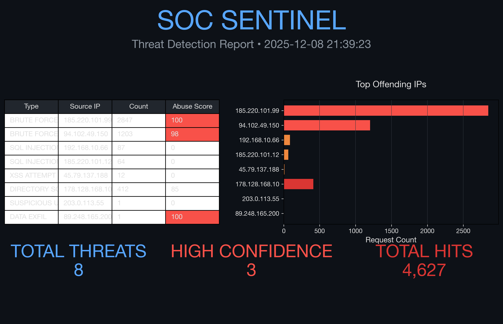

# SOC Sentinel – macOS-native Threat Detection Engine

Professional log-analysis tool that automatically detects brute-force & SQL injection attacks and generates **executive-ready dark-mode reports**.

Built 100% on macOS (Apple Silicon + Intel) using Python 3.13, pandas 2.2.3, and matplotlib 3.9.2.

### Demo


### Run in 60 Seconds (macOS)

```bash
git clone https://github.com/kleckie7/soc-sentinel-macos.git
cd soc-sentinel-macos
python3 -m venv venv && source venv/bin/activate
pip install -r requirements.txt
chmod +x main.py
./main.py


